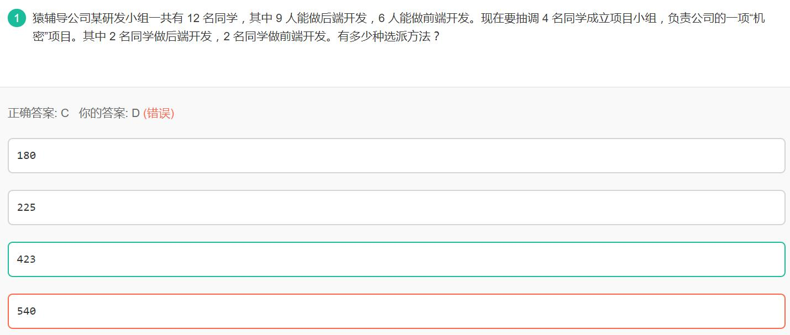

<head>
    
    
</head>

# 选择题
[TOC]
## 1. 排列组合问题

12个人中有6人会前端，9人会后端
6+9-12=3个人既会前端也会后端，3个人只会前端，6个人只会后端
方法一：直接累加
>思路：从3个两个都会的人中选0、1或2个人去做前端，分三种情况讨论

(1)在3个都会的人中选0个去开发前端
$C_3^0\cdot C_3^2 \cdot C_9^2=108$
(2)在3个都会的人中选1个去开发前端
$C_3^1\cdot C_3^1\cdot C_8^2=252$
(3)在3个都会的人中选2个去开发前端
$C_3^2\cdot C_3^0 \cdot C_7^2=63$

总计 $108+252+63=423$

> 思考：为什么不用加3个人去开发后端的3种情况？原因是在后面的$C_9^2$中已经考虑了这三个人去开发后端的情况，例如(1)中3个人没有取开发前端的，那他们去开发后端的情况分为0、1或2，得到$C_3^2\cdot C_6^0 + C_3^1\cdot C_6^1 + C_3^0\cdot C_6^2=36$，这些情况使用$C_9^2=36$已经全包括了，所以没有再单独考虑B情况的必要了。

方法二：总的情况减去不合法的情况
总的情况为：$C_9^2\cdot C_6^2=540$
有4人被选中才是合法的，不合法情况如下：

(1) 3个都会的人有1个被选去开发前端，但同时也被选中去开发后端
$C_3^1\cdot C_3^1\cdot C_8^1=72$

(2) 3个都会的人中有2个人被选中既开发前端也开发后端
$C_3^2=3$

(3) 3个都会的人中有2个人被选中去开发前端，但只有其中一人也被选去开发后端
$C_3^2\cdot C_2^1\cdot C_7^1 = 42$

不合法的有 $72+3+42=117$，合法的有 $540-117=423$