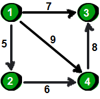

<head>
    <script src="https://cdn.mathjax.org/mathjax/latest/MathJax.js?config=TeX-AMS-MML_HTMLorMML" type="text/javascript"></script>
    <script type="text/x-mathjax-config">
        MathJax.Hub.Config({
            tex2jax: {
            skipTags: ['script', 'noscript', 'style', 'textarea', 'pre'],
            inlineMath: [['$','$']]
            }
        });
    </script>
</head>

# 数据结构笔记

[TOC]
## 1.邻接矩阵和邻接表

### 1.1 邻接矩阵

是一个二维数组$A$，存放顶点和边的关系,如果边没有权重，$i$和$j$节点存在连接对应的元素$a_{ij}=1$，不存在为0

- 有向图：存储需要$n^2$个空间
- 无向图：对称，存储需要$n(n-1)/2$

举例如下：
<center>

</center>

如果边有权重结果如下：
<center>

</center>
 注意：有向图中行对应出度，列对应入度(列入行出)

### 1.2 邻接表
专门存储有向图
<center>  </center>
使用邻接表的方式存储，结果如下：

> 4 5
1 4 9
4 3 8
1 2 5
2 4 6
1 3 7

其中第一行的4和5分别表示顶点的个数和边的个数，后面几行的数字$x\ y\ z$，$x$对应的顶点到$y$对应的顶点的权重为$z$

使用链表来实现邻接表如下：
<center>  </center>

参考：[邻接表的数组实现](https://bbs.codeaha.com/thread-4612-1-1.html)

## 2. 二叉排序树
### 2.1 二叉排序树性质
右子树节点>父节点>左子树的节点
**最大值是树中最右边的节点**，不一定是叶子节点
### 2.2 平衡二叉排序树(AVL树)
注意平衡树首先是排序树
性质：左右子树的高度差不超过1

参考：[二叉排序树](https://www.cnblogs.com/gczr/p/10164955.html)


## 3. 字符串
字符串是一种特殊的线性表，每个元素都是一个单字符，所以既可以连续存储，也可以链式存储
空串$\neq$空白串：字符串可以为空，即长度为0，这种称为**空串**；**空白串**中有可能多个空白字符

```c++
char a[] = "ABCDEF";                    // 字符串，末尾'\0',长度为7
char b[] = {'A','B','C','D','E','F'};   // 字符数组，长度为6
```

## 4. n个数进栈后出栈的个数
出栈的个数是卡特兰数
$f(n)=f(0)*f(n-1)+f(1)*(2)+\cdots+f(n-1)*(0)$
递推解:$f(n)=\frac{C_{2n}^n}{n+1}=C_{2n}^n-C_{2n}^{n+1}$

$$
C_{n}=\frac{1}{n+1}\left(\begin{array}{c}{2 n} \\ {n}\end{array}\right)=\frac{(2 n) !}{(n+1) ! n !}
$$
参考：[n个元素进栈，共有多少种出栈顺序](https://www.cnblogs.com/jiayouwyhit/p/3222973.html)

## 5. 二叉树
### 5.1 二叉树定义
二叉树是度为2的有序树
N个结点的二叉排序树有多种，其中树高最小的二叉排序树是最佳，**树高越小查找的平均次数越少，排序效果越好**

结点的深度和高度
- 结点深度：从树的根结点到该结点的**边的个数**
- 结点高度：叶子结点到该结点的**边的个数**

树的深度和高度
- 这两个大小是相同的，深度是从根结点到叶子节点，高度反过来(均指最大长度)

空树的高度为-1

完美二叉树(perfect binary tree)：所有结点都是满的
完全二叉树(complete binary tree)：除了最后一层都是满的，最后一层左对齐
完满二叉树(full binary tree)：除了叶子结点的每个结点都有两个孩子结点

图片如下：
<center>  </center>

**注意：深度从上到下，高度从下到上**

**树的边数+1=结点数**
**边数=度数**

N个结点的完全二叉树的深度为：$[log_2(N+1)]$或$[log_2(N)]+1$，$[\ ]$表示向下取整，这里**层数包括根结点**

**一棵树转换为唯一的二叉树，即二叉树与树一一对应**

参考：[二叉树概念](https://blog.csdn.net/qq_22642239/article/details/80774013)

### 5.2 二叉树遍历
||遍历顺序|
|-|-|-|
|前序|父结点$\rightarrow$左子树$\rightarrow$右子树|
|中序|左子树$\rightarrow$父结点$\rightarrow$右子树|
|后序|左子树$\rightarrow$右子树$\rightarrow$父结点|
|后序|逐层遍历就行|

注意：对于中序遍历如果没有左子树，可以直接访问其父节点，总之从树的左下角开始遍历

参考：[二叉树的四种遍历方法笔记](https://www.cnblogs.com/fly-me/p/wei-ti-jiaoer-cha-shu-de-si-zhong-bian-li-fang-fa.html)

### 5.3 完全二叉树
性质：
1. $n_0 = n_2+1$，**度为2的结点数比度为0的结点数少1**(所有二叉树的性质)
2. 已知完全二叉树有$n$个结点
 $n$为偶数时，叶子结点数=总结点数/2
 $n$为奇数时，叶子结点数=(总结点数+1)/2

## 6. 堆
### 6.1 堆的概念
堆是一种完全二叉树
升序使用大顶堆，降序使用小顶堆(将根节点去掉后是放在数组的后面，每次取根节点要放在已经排序数组的左边)

堆排序的空间复杂度O(1)，堆排序构建堆的时间复杂度O(n)，堆排序的时间复杂度为O(nlogn)

性质：
1. 小根堆中最大的数一定在叶子结点上，堆本身是完全二叉树，**完全二叉树的叶子结点位置大于[n/2]**，其中[ ]表示向下取整
### 6.2 堆的存储
使用数组来模拟二叉树
1. 如果根结点从数组0开始存储：
父结点$i$的左孩子为$2*i+1$，右孩子为$2*i+2$
2. 如果根结点从数组1开始存储：
父结点$i$的左孩子为$2*i$，右孩子为$2*i+1$


## 7. 队列
双端队列 = 队列+栈
队列的两头都可以进行插入和删除的操作
- 输入受限的双端队列：只能从队列一端输入，可以从两端输出的双端队列；
- 输出受限的双端队列：只能从队列一端输出，可以从两端输入的双端队列

注意：受阻后只能从一端进行操作

## 8. 排序
<center>  </center>

选择排序和希尔排序是一种不稳定的排序算法，相等的数可能交换顺序
1. 算法复杂度与初始状态无关的有：**堆排序 $O(nlog_2n)$、归并排序 $O(nlog_2n)$、选择排序 $O(n^2)$、基数排序 $O(d(n+r))$**
2. 元素**总比较次数**与初始状态无关的有：**选择排序 ($\frac{n(n+1)}{2}$次比较)、基数排序 ($0$次比较)**
3. 元素**总移动次数**与初始状态无关的有：**归并排序 (移动$n$次)、基数排序 (对应于每个位的次数)**

注意：这里的总移动次数和总比较次数还有点模糊

一堆（堆排序）海龟（归并排序）选（选择排序）基（基数排序）友

参考：[与数组初始状态无关的排序算法](https://www.cnblogs.com/Xieyang-blog/p/8340578.html)


## 9. 链表
### 9.1 静态链表
静态链表:数组的每一个下标都对应一个data和一个cur。数据域data用来存放数据元素，；而游标cur相当于单链表中的next指针，存放该元素的后继在数组中的下标
### 9.2 十字链表
十字链表是**有向图**的一种链式存储结构。该结构可以看成是将有向图的邻接表和逆邻接表结合起来得到的。用十字链表来存储有向图，可以达到高效的存取效果

## 10. 哈希图(HashMap)
哈希表的平均查找长度与**哈希函数、冲突处理方法和装填因子**有关
散列表(HashTable)也称哈希表
(1) HashMap解决hash碰撞：
- 开放定址法
- 再散列法
- 链地址法(拉链法)
- 建立公共溢出区

(2) HashMap常用散列函数
- 直接寻找法
- 数字分析法
- 平方取中法
- 折叠法
- 随机数法
- 除留取余数法
- 乘法取整法

## 11. 有向图和无向图
强连通图：有向图中，任意结点间都存在路径，所以强连通图可以构成环，各个顶点间均可达

## 12. 稀疏矩阵压缩存储
稀疏矩阵只需存储行，列和其对应的元素，得到三元组$(i,j,A_{ij})$，每个三元组**按照行排序**
转置的操作是：
1. 三元组行和列元素对调
2. 然后按照新的行进行排序

## 13. 栈
### 13.1 单链表实现
单链表实现的栈，每次入栈要把**新元素插到链表的头**
设栈顶指针为top，入栈一个节点P，分两种情况
(1) top节点表示真实的栈顶节点
先把top的地址赋值给p的next，然后移动top
```c++
p->next = Top;
top = p;
```
(2) top节点的next指针才是栈顶节点
首先将top的next指针赋值为p的next指针，然后移动top指针
```c++
p->next = top->next;
top->next = p;
```

### 13.2 向量实现
若以向量$V$存储，同样入栈的过程也是往前面插入的过程，设初始栈的栈顶指针是n+1，只有1~n才是有效的索引
每次入栈，都是先下移top指针，然后为其赋值
```c++
top = top - 1;
V[top] = p;
```

注意：**局部变量分配在栈上，new出来的对象分配在堆上**