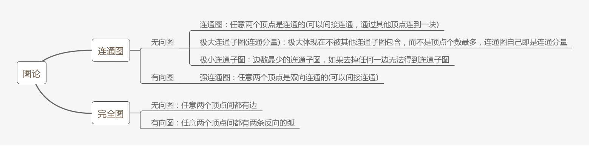
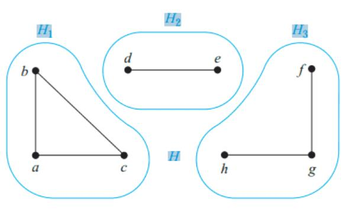
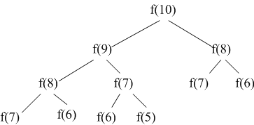
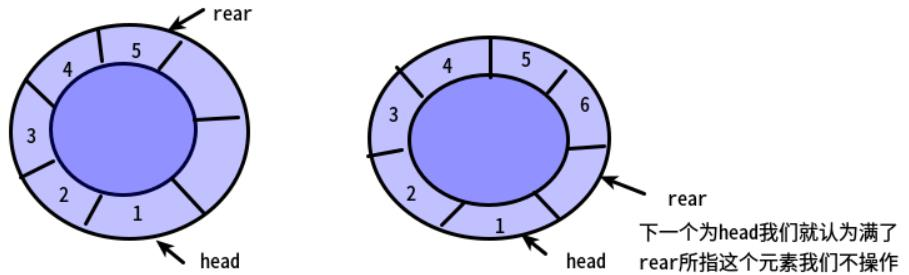
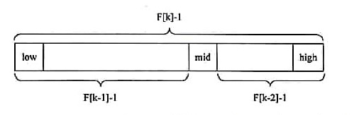
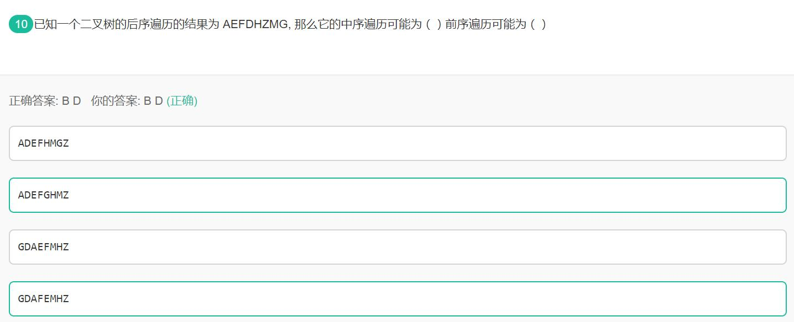
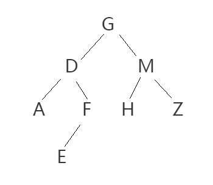

<head>
    <script src="https://cdn.mathjax.org/mathjax/latest/MathJax.js?config=TeX-AMS-MML_HTMLorMML" type="text/javascript"></script>
    <script type="text/x-mathjax-config">
        MathJax.Hub.Config({
            tex2jax: {
            skipTags: ['script', 'noscript', 'style', 'textarea', 'pre'],
            inlineMath: [['$','$']]
            }
        });
    </script>
</head>


# 数据结构笔记2

[TOC]
## 1. 线性表

### 1.1 线性表平均查找长度
(1) 单块线性表
设线性表长度为n，则查找次数可能为1,2,3,...,n，一共n次
$average\_search=\frac{1+2+3+\cdots + n}{n}=\frac{n+1}{2}$
(2) 分块线性表
假设每个块内元素个数是相同的
查找步骤：
1. 将待查找的key与索引表对比，找到key对应的区块，假设有m个区块，平均查找长度如下：
$block\_avg\_search=\frac{1+2+3+\cdots + m}{m}=\frac{m+1}{2}$
2. 在对应的块内进行搜索，假设块内有n个数据，平均查找长度如下：
$data\_avg\_search=\frac{1+2+3+\cdots + n}{n}=\frac{n+1}{2}$
(3) 将上述两个时间累加得到分块搜索的平均查找长度
$total\_search = \frac{m+1}{2}+\frac{n+1}{2}$

分块线性平均查找长度=索引表平均查找长度+块内平均查找长度
示意图如下：
<center>

</center>

## 2. 堆
堆最适合创建一个优先级队列，优先队列是一种**自动排序**的队列

## 3. 有向图
### 3.1 概念
有向无环图 (Directed Acyclic Graph，DAG)
有向图D是顶点V和弧arc的多重集A表示，写作$D=V\bigcup A$或$D=(V,A)$
od(v)表示出度，id(v)表示入度

> 有向图满足$v\in V, od(v)=1$条件后，得从$V$到$V的一个映射图$

参考：[有向无环图](https://www.jiqizhixin.com/graph/technologies/419aac7d-3b71-41da-b02b-70c136a14d44)

### 3.2 拓扑排序
拓扑排序 topological sorting
性质：
1. 每个顶点只出现一次
2. 若A排在B前面，再图中不会有从B到A的路径

步骤：
1. 从有向图选取一个没有前驱的顶点输出
2. 从有向图中删除该顶点及以它为尾部的弧
3. 将满足的顶点按序号写出来便得到拓扑排序

## 4. 无向图
### 4.1 最小生成树
>最小生成树是图的**极小连通子图**，包含原图的所有顶点，并且使所有的权值之和尽可能小

获取最小生成树方法：kruskal算法和prim算法
- prim算法：是一种**贪心算法**，(1) 从当前顶点集合出发(开始时集合中只有一个顶点)，找与这些顶点相连并且**边权重最小**的新顶点(集合中未出现过)，然后将该顶点添加到顶点集合中 (2) 重复步骤1直到将图中所有顶点都包含为止
- Kruskal算法：(1) 初始将所有顶点视为独立的树，将所有的边按权重进行递增排序 (2) 从权重最小的边开始，如果该边的**两个顶点不在一棵树**，则合并两个顶点，否则丢弃该边 (3) 重复步骤3直到合成的树包含所有顶点

注意：当无向图中边有相等的权中，最小生成树不唯一，当且仅当所有边的权重不相同时最小生成树唯一

参考： [什么是最小生成树 (知乎)](https://zhuanlan.zhihu.com/p/71856627) [最小生成树 (CSDN)](https://blog.csdn.net/luoshixian099/article/details/51908175)

### 4.2 连通分量
在无向图中，如果两个顶点间有路径，则称两个顶点连通

>连通图：无向图中任意两个顶点间都连通，
非连通图：无向图中存在没有连通的顶点
<center>

</center>

下面是非连通图H及它的连通分量H1、H2和H3：
<center>

</center>


## 5. 递归
堆栈用于执行递归调用
### 5.1 复杂度
>时间复杂度：递归总次数 * 每次递归的计算量
空间复杂度：递归深度 * 每次递归创建变量的个数

f(n) = f(n-1) + f(n-2)实现的斐波那契数列是一颗递归树如下：

<center>

</center>

时间复杂度与结点个数有关，设递归树高度为$h$，每个结点只有一次计算，所以计算量为1，总的时间为$2^h-1$，因此时间复杂度是$O(2^n)$，每次递归只有一个变量所以消耗空间是$h$，因此空间复杂度为$O(n)$

参考：[斐波那契数列复杂度](https://blog.csdn.net/superwangxinrui/article/details/79626870)

### 5.2 尾递归
每次递归函数变化的都是**参数变量**，函数体的表达式并没有进行更新，这样便不会形成递归树，最后输出时调用函数的表达式得出结果

```python
def tailrecsum(x, running_total=0):
  if x == 0:
    return running_total
  else:
    return tailrecsum(x - 1, running_total + x)
```
**尾递归占用的内存是恒定的，而普通递归内存占用会先变大再收缩**

参考：[尾递归(知乎)](https://www.zhihu.com/question/20761771/answer/19996299)


## 6. 循环队列

<center>

</center>

循环队列有两个指针，队头front和队尾rear
为了识别队列的空或满队尾是不存储数据的，
队头数据 base[front]
队尾数据 base[rear - 1]

```c++
front == rear                                      // 表示队列为空
front == (rear + 1) % MAXSIZE                      // 表示队列满了
front = (front + 1) % MAXSIZE                      // 出队操作后指针变化
rear  = (rear + 1) % MAXSIZE                       // 入队操作后指针变化
queue_length = (rear - front + MAXSIZE) % MAXSIZE  //获取队列长度，由于尾部没有元素所以不用加1，防止rear小于front所以要加MAXSIZE
```

参考： [数据结构：循环队列](https://www.cnblogs.com/chenliyang/p/6554141.html)

## 7. 堆
堆是一种近似完全二叉树的数据结构，一般表示为完全二叉树，但也可以表示为非完全二叉树

## 8. 旅行商问题
旅行商问题(Travelling salesman problem, TSP)：在一个带权无向图中找到一个权值最小的回路
使用枚举法：连通图中第一个结点可能性n-1，第二个结点n-2，最终可能性为$(n-1)!$

## 9. 队列
在不使用尾指针的链表作为队列的存储结构，入队操作需要遍历到队尾才能插入数据；
使用**带尾指针的循环单链表**作为存储结构，出队和入队操作复杂度为O(1)

## 10. 红黑树
数据结构底层中`map`是通过散列表+红黑树实现的

## 11. 广义表
广义表K=(m,n,(p,(q,s)),(h,f))
>head() 返回列表的第一个元素
tail() 返回列表删去第一个元素后剩下的列表

`head[tail[head[tail[tail(K)]]]]`需要从力到外计算
```c
tail(K) = (n,(p,(q,s)),(h,f))
tail[tail(K)] = ((p,(q,s)),(h,f))
head[tail[tail(K)]] = (p,(q,s))
tail[head[tail[tail(K)]]] = (q,s)
head[tail[head[tail[tail(K)]]]] = q
```

## 12. 算法复杂度
> 时间复杂度：算法执行过程中所需的计算量，与问题规模有关，用O()表示
> 空间复杂度：算法执行过程中所需的存储空间(变量个数，开辟空间，占用的内存) 

## 13. 概念与性质
- 树适合表示元素间分支层次关系的数据
- **无向连通图**才可以生成树，树一定要带权
- 二叉树中$n_0=n_2+1$，度为2的结点数比度为0的结点数(叶子结点)少1
- 建立长度为$n$的有序单列表的时间复杂度为$O(n^2)$，每次插入都要比较已有的数
- 无向图或有向图(不带权重)中使用广度优先搜索可以获取最短路径距离$\delta(s,v)$
- 带权值的有向图的最短路径不一定唯一，所以最短路径树不一定唯一(有些权值和可能相等) 《算法导论》P377

## 14. KMP模式匹配算法

>Knuth-Morris-Pratt算法, 简称KMP算法，用于字符串匹配
KMP是线性算法，时间复杂度为O(m+n)，m是模式串长度，n是主串长度

思想：利用模式字符串自身前缀和后缀的重复特征来减少比较的次数
步骤：
1. 计算模式字符串的部分匹配表(Partial Match Table,PMT)
2. 使用模式字符串在主串中进行匹配
3. 如果已匹配的字符串长度不为1，则使用`移动位数=已匹配字符数-已匹配部分的最后一个字符的PMT值`来移动模式字符串
4. 重复上述过程直到匹配成功

参考： [字符串匹配的KMP算法](https://kb.cnblogs.com/page/176818/)

## 15. 静态表的顺序查找法
>监视哨：将待查找的key放在第一个或最后一个位置，所以数组长度会加1
作用：减少判断数组是否越界的次数

表头设置监视哨，正确的查找方式是从最后的位置往前找，如果静态表中没有该元素，至少第一个位置会匹配成功并返回0

## 16. 霍夫曼树
每个结点都要与其他结点间构成的子树来构成新的子树，所以没有度为1的结点

## 17. 贪心算法和动态规划算法
待加
## 18. dijkstra算法和floyd算法
待加
## 19. 二叉树的后序线索树遍历
>一般情况二叉树的后序线索树后序遍历会用到额外的栈，

只有左半边的二叉树：后序遍历不用栈，前序遍历用栈
只有右半边的二叉树：前序遍历不用栈，后序遍历不用栈

## 20. 斐波那契查找与二分查找
>斐波那契查找：找到固定序列长度的黄金分割点，划分序列并查找
>二分查找：每次折半划分后查找

<center>

</center>

斐波那契查找步骤：
1. 找到最接近**有序顺序表**查找长度的斐波那契数值来确定拆分点
2. 拆分顺序表并查找
3. 重复上述步骤直到查找完成

两个查找比较：
- 斐波那契查找的平均性能比二分查找好
- 最坏情况下斐波那契查找性能低于二分查找(但[牛客](https://www.nowcoder.com/questionTerminal/4f88d093d7674de491cf3666452d41fb?source=relative)上认为是相反的)
- 斐波那契查找分割时只进行加减运算，而二分查找是除法(除以2可以用右移一位实现，速度应该也很快)

参考：[斐波那契查找 (CSDN)](https://blog.csdn.net/luochoudan/article/details/51629338) $~~$ [斐波那契查找 (CSDN2)](https://blog.csdn.net/happyjacob/article/details/82808589)

## 21. 二叉树遍历
已知后序遍历`AEFDHZMG`推断可能的前序遍历和中序遍历：

>前序遍历：根结点 {左子树点集合} {右子树点集合}
>中序遍历：{左子树点集合} 根结点 {右子树点集合}
>后序遍历：{左子树点集合} {右子树点集合} 根结点

- 解题思路：后序遍历的最后一个点与前序遍历的第一个点是根结点；通过找各个遍历中左子树和右子树的集合来推断；可以**递归**地使用上述特征直到完成整个树结构的推断

<center>

</center>

(1) 后序遍历推断中序遍历
选项A：
如果A正确，则左子树结点集合为：{ADEFHM}，左子树点集合为：{Z}，这样它对应的后序遍历为{ADEFHM}{Z}{G}，其中`{}`中序号需要变化，但由于右子树只有一个Z，所以Z一定在倒数第二个位置，与题设不符可排除
选项B:
如果B正确，则左子树结点集合为：{ADEF}，左子树点集合为：{HMZ}，这样它对应的后序遍历为{ADEF}{HMZ}{G}，`{}`中元素顺序是变化的，可以符合题设，因此B有可能正确
通过选项可以直到左子树和右子树集合：
> 已知：
左子树：{AEFD}
右子树：{HZM}
根结点：{G}
后序遍历结果：AEFDHZMG

在左子树集合{AEFD}中后序遍历的特征仍然存在，即D是左子树中的父节点，
**左子树**有可能出现四种情况：
1. D的左子树是{AEF}，右子树是{}为空

2. D的左子树是{AE}，右子树是{F}
继续利用后序遍历的特征**最后一个结点是根结点**，则E是A的根结点，并且A可能是E的左节点，也可能是右结点

3. D的左子树是{A}，右子树是{EF}

4. D的左子树是{}为空，右子树是{AEF}

总结：每种情况下又有多种划分，总之后序遍历`AEFD`中首先D是根结点是确定的，起初可以把空集合插入到最前和最后所以可以分为4种情况

这里用f(n)表示n个结点进行后序遍历结果可能的二叉树个数，有如下关系： 
(1) 后序遍历结果A，只有一个根结点的树，因此f(1) = 1
(2) 后序遍历结果AB，B是根结点，A可能是左结点也可能是右结点，因此f(2) = 2
(3) 后序遍历结果ABC，则C是根结点，可以分为如下情况：
当后序遍历为空时，我们把它视为一种情况，即f(0) = 1
|左子树情况|右子树情况|结构种类个数|
|-|-|-|-|
|{ }|AB|f(0)*f(2)=2|
|A|B|f(1)*f(1)=1|
|AB|{ }|f(2)*f(0)=2|

因此 f(3) = f(0)*f(2) + f(1)*f(1) + f(2)*f(0)

设有n个结点时，递推公式为：
$$
f(n) = f(0)*f(n-1) + f(1)*f(n-2) + f(2)*f(n-3) + \cdots + f(n-2)*f(1) + f(n-1)*f(0)  \tag{1}
$$
其中f(n)和所有之前的f都有关，之前的f出现次数是成对的，看到上面的递推公式，想到卡特兰数在入栈出栈次数计算中的应用，如下：
递推解:$f(n)=\frac{C_{2n}^n}{n+1}=C_{2n}^n-C_{2n}^{n+1}$

$$
C_{n}=\frac{1}{n+1}\left(\begin{array}{c}{2 n} \\ {n}\end{array}\right)=\frac{(2 n) !}{(n+1) ! n !}
$$

将n=3代入上述公式得$f(3)=5$
> 入栈出栈个数的公式竟然与二叉树结构种类数公式一样，可以将n个数的入栈看做最后一个数是根结点，其他n-1个数入栈出栈可以分成两个部分，入栈出栈个数可以用f(i)(n-1-i)表示，其中i可以从0取到n-1，可以将f(i)表示左子树的可能个数,f(n-1-i)表示右子树的可能个数，将所有情况累加正好与上面的公式(1)对应，太巧妙了！

**总之如果只从后序遍历结果推算二叉树的结构，可能性太多，但如果给出两种遍历结果，则二叉树的结构已经可以确定，可以直接推理得到剩下的遍历结果**

回到上面的题目上，
选项C和D只是EF的顺序不同，但可以得出左子树结点集合{AEFD}，右子树结点集合{HZM}，根结点为G，由于是后序遍历所有在AEFD中可以确定D是父节点
借助B选项`ADEFGHMZ`提供的信息：
后序遍历结果{AEFD}得出D是父节点，而中序遍历{ADEF}得出A是左子树，EF是右子树，而根据后序遍历结果EF，得出F是E的父结点，中序遍历EF得到E是左结点；同理后序遍历结果{HZM}中得到M是根结点，而中序遍历{HMZ}得到H是左结点，Z是右结点

最终树结构如下：
<center>

</center>
所以前序遍历的结果为`GDAFEMHZ`，D选项正确

**总结：利用前序遍历第一个是根结点，后序遍历最后一个是根结点，而中序遍历根据根结点将数据分为左右子树这个特征来从两个遍历结果推算剩下的遍历结果**