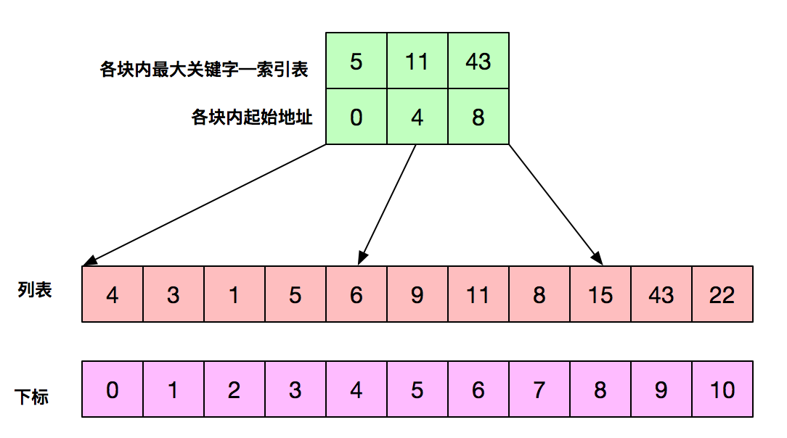

<head>
    <script src="https://cdn.mathjax.org/mathjax/latest/MathJax.js?config=TeX-AMS-MML_HTMLorMML" type="text/javascript"></script>
    <script type="text/x-mathjax-config">
        MathJax.Hub.Config({
            tex2jax: {
            skipTags: ['script', 'noscript', 'style', 'textarea', 'pre'],
            inlineMath: [['$','$']]
            }
        });
    </script>
</head>


# 数据结构笔记2

[TOC]
## 1. 线性表

### 1.1 线性表平均查找长度
(1) 单块线性表
设线性表长度为n，则查找次数可能为1,2,3,...,n，一共n次
$average\_search=\frac{1+2+3+\cdots + n}{n}=\frac{n+1}{2}$
(2) 分块线性表
假设每个块内元素个数是相同的
查找步骤：
1. 将待查找的key与索引表对比，找到key对应的区块，假设有m个区块，平均查找长度如下：
$block\_avg\_search=\frac{1+2+3+\cdots + m}{m}=\frac{m+1}{2}$
2. 在对应的块内进行搜索，假设块内有n个数据，平均查找长度如下：
$data\_avg\_search=\frac{1+2+3+\cdots + n}{n}=\frac{n+1}{2}$
(3) 将上述两个时间累加得到分块搜索的平均查找长度
$total\_search = \frac{m+1}{2}+\frac{n+1}{2}$

分块线性平均查找长度=索引表平均查找长度+块内平均查找长度
示意图如下：
<center>

</center>

## 2. 堆
堆最适合创建一个优先级队列，优先队列是一种**自动排序**的队列

## 3. 有向图
### 3.1 概念
有向无环图 (Directed Acyclic Graph，DAG)
有向图D是顶点V和弧arc的多重集A表示，写作$D=V\bigcup A$或$D=(V,A)$
od(v)表示出度，id(v)表示入度

> 有向图满足$v\in V, od(v)=1$条件后，得从$V$到$V的一个映射图$

参考：[有向无环图](https://www.jiqizhixin.com/graph/technologies/419aac7d-3b71-41da-b02b-70c136a14d44)

### 3.2 拓扑排序
拓扑排序 topological sorting
性质：
1. 每个顶点只出现一次
2. 若A排在B前面，再图中不会有从B到A的路径

步骤：
1. 从有向图选取一个没有前驱的顶点输出
2. 从有向图中删除该顶点及以它为尾部的弧
3. 将满足的顶点按序号写出来便得到拓扑排序


## 4. 旅行商问题
旅行商问题(Travelling salesman problem, TSP)：在一个带权无向图中找到一个权值最小的回路
使用枚举法：连通图中第一个结点可能性n-1，第二个结点n-2，最终可能性为$(n-1)!$

## 5. 递归
堆栈用于执行递归调用
### 5.1 复杂度
>时间复杂度：递归总次数 * 每次递归的计算量
空间复杂度：递归深度 * 每次递归创建变量的个数


f(n) = f(n-1) + f(n-2)实现的斐波那契数列是一颗递归树如下：

<center>

</center>

时间复杂度与结点个数有关，设递归树高度为$h$，每个结点只有一次计算，所以计算量为1，总的时间为$2^h-1$，因此时间复杂度是$O(2^n)$，每次递归只有一个变量所以消耗空间是$h$，因此空间复杂度为$O(n)$

参考：[斐波那契数列复杂度](https://blog.csdn.net/superwangxinrui/article/details/79626870)

### 5.2 尾递归
每次递归函数变化的都是**参数变量**，函数体的表达式并没有进行更新，这样便不会形成递归树，最后输出时调用函数的表达式得出结果

```python
def tailrecsum(x, running_total=0):
  if x == 0:
    return running_total
  else:
    return tailrecsum(x - 1, running_total + x)
```
**尾递归占用的内存是恒定的，而普通递归内存占用会先变大再收缩**

参考：[尾递归(知乎)](https://www.zhihu.com/question/20761771/answer/19996299)


## 6. 循环队列

<center>

</center>

循环队列有两个指针，队头front和队尾rear
为了识别队列的空或满队尾是不存储数据的，
队头数据 base[front]
队尾数据 base[rear - 1]

```c++
front == rear                                      // 表示队列为空
front == (rear + 1) % MAXSIZE                      // 表示队列满了
front = (fron + 1) % MAXSIZE                       // 出队操作后指针变化
rear  = (rear + 1) % MAXSIZE                       // 入队操作后指针变化
queue_length = (rear - front + MAXSIZE) % MAXSIZE  //获取队列长度，由于尾部没有元素所以不用加1，防止rear小于front所以要加MAXSIZE
```

参考： [数据结构：循环队列](https://www.cnblogs.com/chenliyang/p/6554141.html)

## 7. 堆
堆是一种近似完全二叉树的数据结构，一般表示为完全二叉树，但也可以表示为非完全二叉树